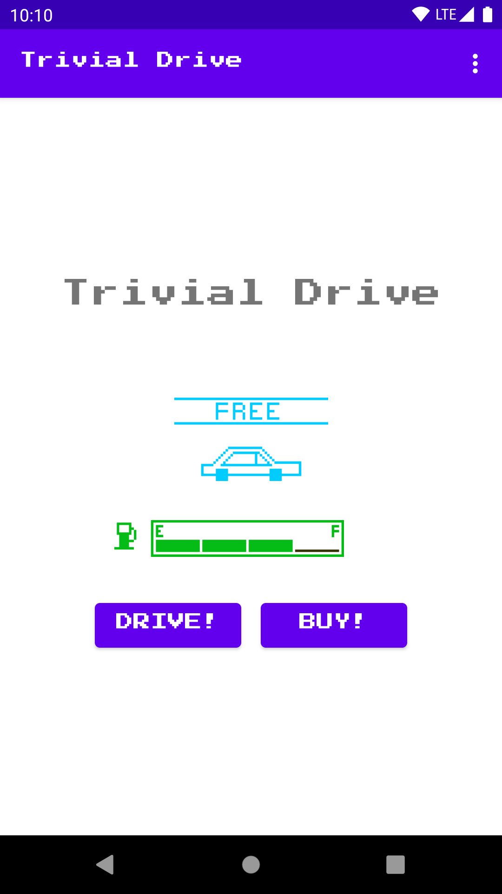
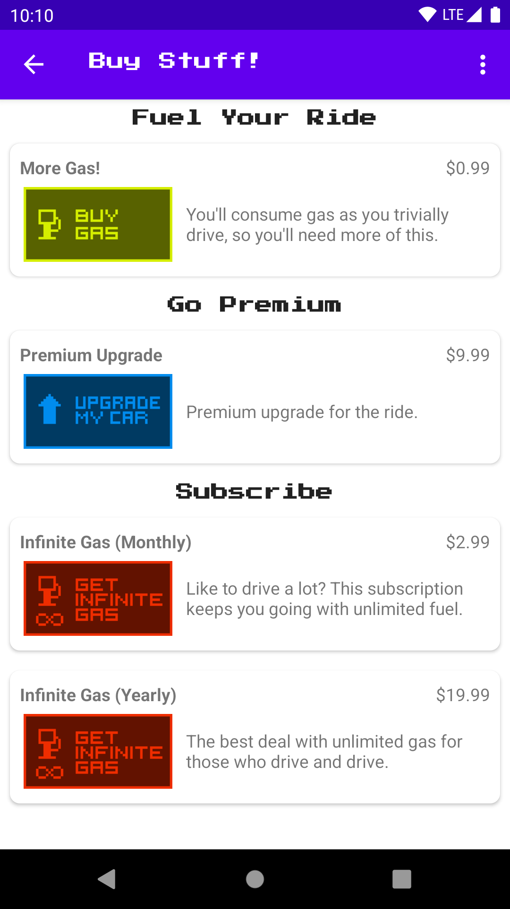

Trivial Drive
============

Sample for In-App Billing Library version 3

Introduction
------------

This sample is provided to demonstrate Google Play In-app Billing. To read
more visit https://developer.android.com/google/play/billing/index.html

This game is a simple "driving" game where the player can buy gas
and drive. The car has a tank which stores gas. When the player purchases
gas, the tank fills up (1/4 tank at a time). When the player drives, the gas
in the tank diminishes (also 1/4 tank at a time).

The user can also purchase a "premium upgrade" that gives them a red car
instead of the standard blue one (exciting!).

The user can also purchase a subscription ("infinite gas") that allows them
to drive without using up any gas while that subscription is active. The
subscription can either be purchased monthly or yearly.

Pre-requisites
--------------

- [Documentation](https://developer.android.com/google/play/billing/billing_overview.html)

Screenshots
-----------

Getting Started
---------------

This sample can't be run as-is. You have to create your own
application instance in the Developer Console and modify this
sample to point to it. Here is what you must do:

ON THE GOOGLE PLAY DEVELOPER CONSOLE

1. Create an application on the Developer Console, available at
   https://play.google.com/apps/publish/.

2. Copy the application's public key (a base-64 string). You can find this in
   the "Services & APIs" section under "Licensing & In-App Billing".

IN THE CODE

3. Open MainActivity.java, find the declaration of base64EncodedPublicKey and
   replace the placeholder value with the public key you retrieved in Step 2.

4. Change the sample's package name to your package name. To do that, update the
   package name in AndroidManifest.xml and correct the references (especially the
   references to the R object).

5. Export an APK, signing it with your PRODUCTION (not debug) developer certificate.

BACK TO THE GOOGLE PLAY DEVELOPER CONSOLE

6. Upload your APK to Google Play for Alpha Testing.

7. Make sure to add your test account (the one you will use to test purchases)
   to the "testers" section of your app. Your test account CANNOT BE THE SAME AS
   THE PUBLISHER ACCOUNT. If it is, your purchases won't go through.

8. Under In-app Products, create MANAGED in-app items with these IDs:
       premium, gas
   Set their prices to 1 dollar. You can choose a different price if you like.

9. Under In-app Products, create SUBSCRIPTION items with these IDs:
       infinite_gas_monthly, infinite_gas_yearly
   Set their prices to 1 dollar and the billing recurrence to monthly for
   infinite_gas_monthly and yearly for infinite_gas_yearly. To prevent being charged
   while testing, set the trial period to 7 days.

10. Publish your APK to the Alpha channel. Wait 2-3 hours for Google Play to process the APK
   If you don't wait for Google Play to process the APK, you might see errors where Google Play
   says that "this version of the application is not enabled for in-app billing" or something
   similar. Ensure that the In-App products move to the "Active" state within the console before
   testing.

TEST THE CODE

11. Install the APK signed with your PRODUCTION certificate, to a
test device [*].
12. Run the app.
13. Make purchases using the test account you added in Step 7.

Remember to refund any real purchases you make, if you don't want the
charges to actually to through. Remember, you can use the tester functionality within
the Google Play console to define test Google Accounts that won't be charged.
When using the tester functionality make sure to look for "Test" language appended
to each receipt. If you don't see "Test" then you will need to be sure to refund/cancel
the charge.

[*]: it will be easier to use a test device that doesn't have your
developer account logged in; this is because, if you attempt to purchase
an in-app item using the same account that you used to publish the app,
the purchase will not go through.

A NOTE ABOUT SECURITY
---------------------

This sample app implements signature verification but does not demonstrate
how to enforce a tight security model. When releasing a production application
to the general public, we highly recommend that you implement the security best
practices described in our documentation at:

http://developer.android.com/google/play/billing/billing_best_practices.html

In particular, you should set developer payload strings when making purchase
requests and you should verify them when reading back the results. This will make
it more difficult for a malicious party to perform a replay attack on your app.

Support
-------
If you've found an error in this sample, please file an issue:
https://github.com/googlesamples/android-play-billing/issues

Patches are encouraged, and may be submitted by forking this project and
submitting a pull request through GitHub.

License
-------
Copyright 2012 Google, Inc.

Licensed to the Apache Software Foundation (ASF) under one or more contributor
license agreements.  See the NOTICE file distributed with this work for
additional information regarding copyright ownership.  The ASF licenses this
file to you under the Apache License, Version 2.0 (the "License"); you may not
use this file except in compliance with the License.  You may obtain a copy of
the License at

  http://www.apache.org/licenses/LICENSE-2.0

Unless required by applicable law or agreed to in writing, software
distributed under the License is distributed on an "AS IS" BASIS, WITHOUT
WARRANTIES OR CONDITIONS OF ANY KIND, either express or implied.  See the
License for the specific language governing permissions and limitations under
the License.

CHANGELOG
---------

   2012-11-29: Initial release
   2013-01-08: Updated to include support for subscriptions
   2015-03-13: Updated to new dev console and added yearly subscriptions
   2015-08-27: Ported to gradle and prepped for transitioning to GitHub
   2021-04-01: Ported to In-App-Billing Library V3
